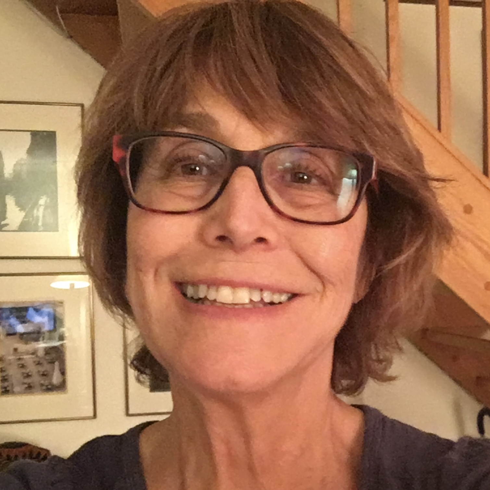

# Barbara Cervone

Barbara Cervone is a lifelong leader in progressive education, advancing schools where students are deeply known, actively engaged, and treated as creators of knowledge rather than passive recipients. Through her work founding schools, directing large-scale reform efforts, and publishing books co-authored with students, she has spent five decades elevating youth voice and reimagining what learning can look like.

Dr. Cervone founded a network of more than 15 alternative high schools, coordinated Walter H. Annenberg's $500 million Challenge to reform American public education, and later created [What Kids Can Do](https://www.whatkidscando.org), a national nonprofit dedicated to the value of young people's work and perspectives. Through its publishing arm, Next Generation Press, she produced more than 15 books with student co-authors. Her book *Fires in the Bathroom* (The New Press, 2003) was the best-selling teacher education book for two consecutive years.

She holds a B.A., *summa cum laude*, from Radcliffe College and both an M.A.T. and Ed.D. from the Harvard Graduate School of Education. In 2008, she received the Purpose Prize from Civic Ventures for her contributions to elevating youth voice in education and community life.

Barbara now lives in Ashland, Oregon, where she writes [Postcards from the Rogue Valley](https://www.postcards-from-the-rogue-valley.blog/), a personal essay blog on nature, community, education, and life in Southern Oregon.
